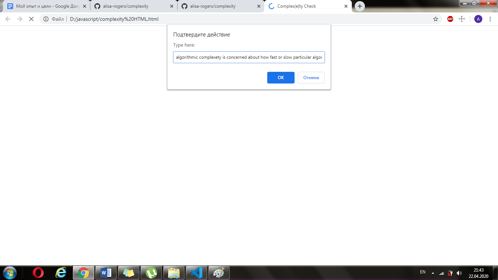
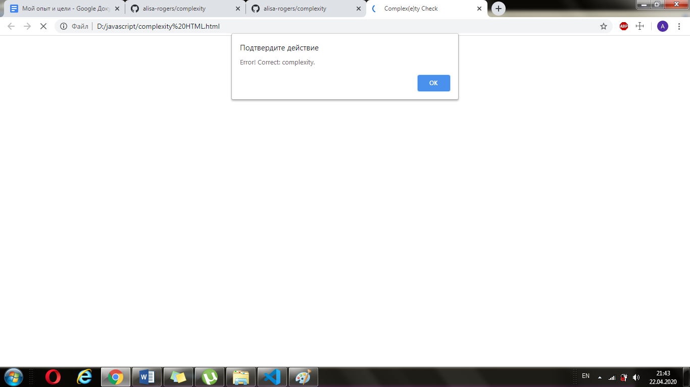

# complex(e)ty check

The script checks if the input entered by user contains the word "complexety". If it does, the script shows a message about the error. 
The message also includes information about the correct way of spelling this word - "complexity".

Tests:
| Input                                             | Expected result             | Actual result               |
|---------------------------------------------------|-----------------------------|-----------------------------|
| complexity check                                  | Correct!                    | Correct!                    |
| complexety check                                  | Error! Correct: complexity. | Error! Correct: complexity. |
| complexetyyyy check                               | Correct!                    | Correct!                    |
| ccccomplexety check                               | Correct!                    | Correct!                    |
| algorithm complexity natural language processing  | Correct!                    | Correct!                    |
| algorithm complexety natural language processing  | Error! Correct: complexity. | Error! Correct: complexity. |
| complexity                                        | Correct!                    | Correct!                    |
| complexety                                        | Error! Correct: complexity. | Error! Correct: complexity. |
| complexity natural language processing complexity | Correct!                    | Correct!                    |
| complexety natural language processing complexety | Error! Correct: complexity. | Error! Correct: complexity. |
| complexety natural language processing complexity | Error! Correct: complexity. | Error! Correct: complexity. |
| COMPLEXETY                                        | Correct!                    | Correct!                    |  
| complEXETY                                        | Correct!                    | Correct!                    |  
| cOmPlExEty                                        | Correct!                    | Correct!                    |  

Screens:

Important: the script recognises as an incorrect word only the word "complexety" written with the lowercase letters.
